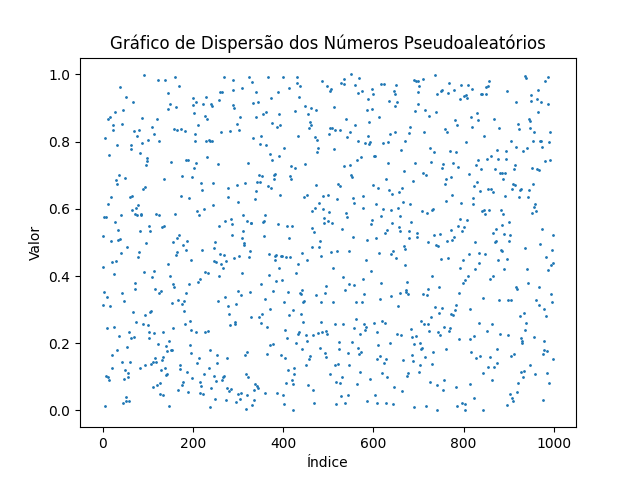

# SMA - Desenvolvimento de um gerador de números pseudo-aleatórios

Pontifícia Universidade Católica do Rio Grande do Sul
Escola Politécnica
Engenharia de Software
4611G-04 - Simulação e Métodos Analíticos
Turma 031 - 2023/1
Aluno: Marco Goedert

## Enunciado

Utilizando o conceito do método Congruente Linear para geração de números pseudo-aleatórios, programe um método que gere 1.000 (mil) números (entre os valores 0 e 1) a fim de produzir um gráfico de dispersão. 

Você pode utilizar a linguagem de programação que desejar.

A fim de validar seu método, envie um arquivo texto com os 1.000 números pseudo-aleatórios produzidos pelo seu método, o gráfico de dispersão destes números, e também um arquivo contendo os valores utilizados para as variáveis X0 (semente), a, c e M.

## Resolução

O método congruente linear é um método de geração de números pseudo-aleatórios que utiliza uma função linear para gerar uma sequência de números pseudo-aleatórios. A função linear é dada por:


onde X<sub>i</sub> é o número pseudo-aleatório gerado na iteração i, X<sub>i+1</sub> é o número pseudo-aleatório gerado na iteração i+1, a, c e M são constantes inteiras e X<sub>0</sub> é a semente.

Para gerar os números pseudo-aleatórios, é necessário definir os valores das constantes a, c e M. Para isso, foi utilizado o método de Park e Miller (Numerical Recipes), que utiliza os valores:


Para a semente, foi utilizado o tempo atual do relógio.

O programa foi desenvolvido em Python 3.8.10 e utiliza a biblioteca matplotlib para gerar o gráfico de dispersão.



## Execução

Para executar o programa, é necessário ter o Python 3 instalado. Para instalar o Python 3 no Ubuntu, execute o comando:

```bash
sudo apt install python3
```

Para instalar o Python 3 no Windows, acesse o site https://www.python.org/downloads/windows/ e baixe o instalador.

Para instalar a biblioteca matplotlib, execute o comando:

```bash
pip3 install matplotlib
```

Para executar o programa, execute o comando:

```bash
python3 main.py
```

O programa irá gerar o arquivo `numbers.txt` com os números pseudo-aleatórios gerados, o arquivo `scatter.png` com o gráfico de dispersão e o arquivo `variables.txt` com os valores das constantes utilizadas. A seed utilizada será o tempo atual do relógio. Alternativamente, caso queira utilizar uma seed específica, execute o comando:

```bash
python3 main.py --seed <integer>
```

## Referências

- https://en.wikipedia.org/wiki/Linear_congruential_generator
- https://www.unf.edu/~cwinton/html/cop4300/s09/class.notes/LCGinfo.pdf